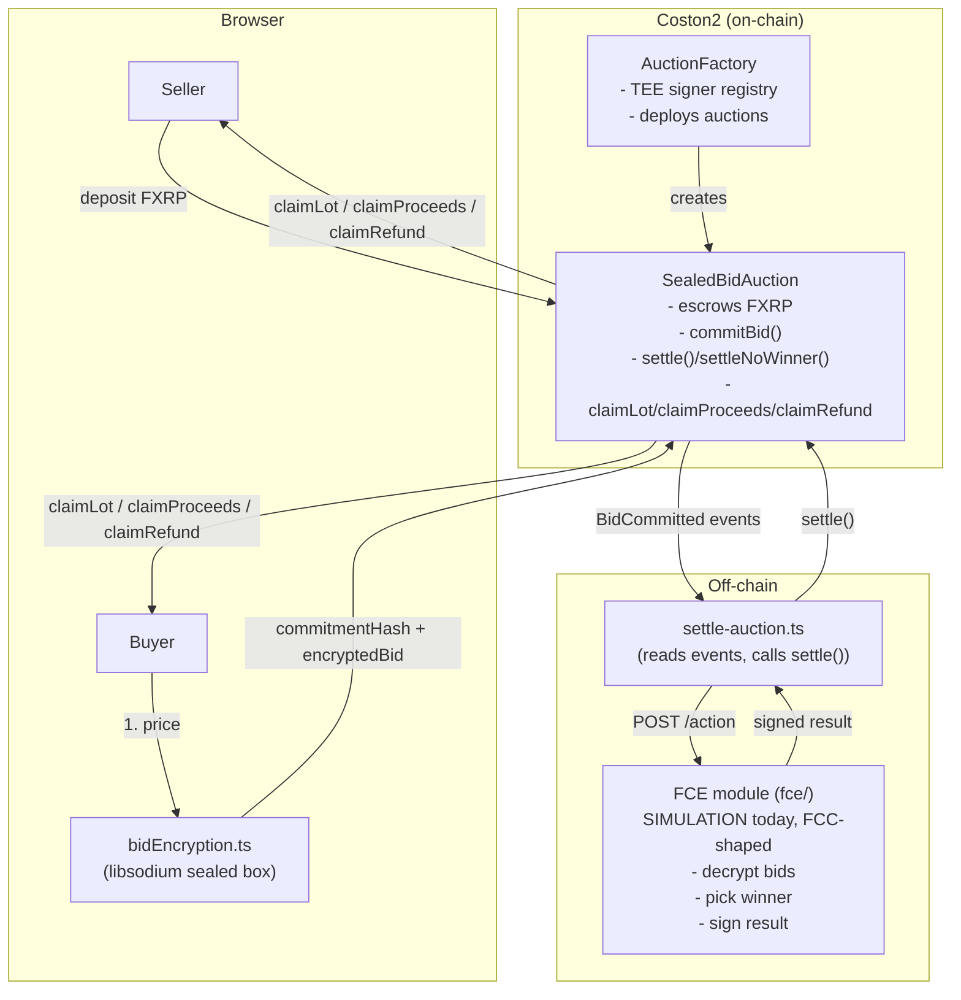

# SealedFlare

Sealed-bid OTC auctions for FXRP on Flare Coston2, built for the **Flare Summer
Signal** hackathon (Confidential Compute Apps track).

## The problem

A large FXRP sell order on a fully transparent chain is visible before it
executes — the market front-runs it, the price moves against the seller
before the trade completes, and institutions holding large positions simply
won't trade this way. This is exactly the class of problem Flare's
Confidential Compute direction exists to solve.

## The solution

1. A seller creates an auction: FXRP is escrowed in a contract, with a bidding
   window and (optionally hidden) reserve price.
2. Buyers submit bids encrypted, in the browser, to a confidential compute
   module's public key. Only a commitment hash and the ciphertext ever land
   on-chain (in an event, not storage) - nobody, including this dApp's own
   contracts, ever sees another bidder's price.
3. Once the window closes, the confidential module decrypts every bid,
   determines a winner (or that none clears the reserve), and signs the
   result with its own identity key.
4. The auction contract verifies that signature against a registered signer,
   pays the winner's FXRP lot and the seller's proceeds, and refunds every
   other bidder's deposit. Only the winning price is ever made public -
   losing bids stay private forever.

## Architecture



## What works today

Everything above is real and has been run end-to-end against live contracts
on Coston2 (chain 114), not just in local tests:

- `contracts/` - `AuctionFactory` + `SealedBidAuction` (Solidity, Foundry),
  19 tests covering the happy path, no-bid/expiry, reserve enforcement, and
  untrusted-signer rejection.
- `fce/` - the confidential compute module, running in **SIMULATION** mode
  (see below), Dockerized, plus the settlement relayer script.
- `frontend/` - Next.js + wagmi: create an auction, submit a sealed bid,
  browse auctions with live countdowns, claim results - with a live FTSO
  XRP/USD reference price on the creation and bidding forms. The dark UI's
  accent palette takes a subtle cue from Flare Network's official brand kit
  (Flare Pink).

Deployed on Coston2:

- `AuctionFactory`: [`0x58158479582bc0BA6bEa5822eaAE01a8Bd6E47A1`](https://coston2-explorer.flare.network/address/0x58158479582bc0ba6bea5822eaae01a8bd6e47a1)

## Running it yourself

**Hosted demo:** https://sealedflare-anubis-crypto.vercel.app - works
against the live Coston2 contracts, no local setup needed. You can browse
auctions, create one, and submit a sealed bid directly from there; only
*settling* an auction needs the FCE module running locally (see below), so
that step isn't available from the hosted link alone.

That works because the frontend hardcodes the FCE module's sealed-box
**public** encryption key (`frontend/lib/contracts.ts`). That's intentional
and safe, not an oversight: it's a public key by design - anyone can encrypt
to it, only the paired private key inside the FCE module can decrypt - and
it's the exact same key already registered as the trusted TEE signer on the
deployed `AuctionFactory` above, so nothing is exposed that wasn't already
implied by that on-chain registration. What must never be hardcoded or
committed is the *private* half, which never leaves the FCE module.

Two ways to go deeper, depending on how much you want to touch:

**Quick look — run the frontend locally.** Works against the
already-deployed `AuctionFactory` above out of the box:

```bash
git clone https://github.com/AnubisCrypto666/sealedflare.git
cd sealedflare/frontend
npm install
npm run dev
```

Open `http://localhost:3000`, connect a Coston2 wallet (MetaMask/Rabby -
network `https://coston2-api.flare.network/ext/C/rpc`, chain ID `114`), and
get test funds from the [Coston2 faucet](https://faucet.flare.network/coston2)
(C2FLR + FXRP). You'll see the real auctions created during development,
including ones already settled end-to-end. You can create a new auction and
submit a sealed bid this way too.

**Full loop, including settlement, on your own instance.** Settling an
auction needs a signature from a TEE signer that `AuctionFactory` trusts -
our factory only trusts *our* deployment's signer, so to run the settlement
step yourself (not just create/bid), deploy your own instance instead of
depending on ours:

```bash
# 1. Deploy your own AuctionFactory (owner = your deployer key)
cd contracts
cp .env.example .env   # fill in PRIVATE_KEY - a fresh Coston2 test wallet, funded from the faucet
forge install
forge test             # 19 tests should pass
forge script script/Deploy.s.sol:Deploy --rpc-url coston2 --broadcast

# 2. Run the FCE module - it generates its own identity on first boot
cd ../fce
docker compose up -d --build
curl http://localhost:8787/identity   # copy "signingAddress"

# 3. Register that signer with YOUR factory (you're the owner, so this works)
cast send <YOUR_FACTORY_ADDRESS> "registerTeeSigner(address)" <SIGNING_ADDRESS> \
  --rpc-url https://coston2-api.flare.network/ext/C/rpc --private-key $PRIVATE_KEY

# 4. Point the frontend at your factory
cd ../frontend
echo "NEXT_PUBLIC_AUCTION_FACTORY_ADDRESS=<YOUR_FACTORY_ADDRESS>" >> .env.local
npm install && npm run dev
```

From there: create an auction, submit a bid from a second wallet, wait for
the bidding window to close, then settle it yourself:

```bash
cd fce
COSTON2_RPC_URL=https://coston2-api.flare.network/ext/C/rpc \
SETTLER_PRIVATE_KEY=$PRIVATE_KEY \
  npx tsx src/settle-auction.ts <YOUR_AUCTION_ADDRESS>
```

This deliberately does **not** ship a shared FCE signing key in the repo -
that key can forge settlement results for anything it's trusted for, so
publishing it would let anyone rewrite the outcome of the live demo auctions
above. Deploying your own instance costs nothing (testnet) and takes a few
minutes.

## Why SIMULATION mode

The Flare team confirmed on Discord (17 July 2026) that, since public FCC
(Flare Compute Extension) registration isn't open yet, developers should
build against a simulated TEE on Coston2 for this hackathon. So `fce/` runs
as a plain (Dockerized) service today, implementing the same trust model a
real FCC extension uses - see `fce/README.md`'s "fce-weather-insurance"
comparison - just without the actual `TeeExtensionRegistry`/`ext-proxy`
infrastructure that isn't reachable yet.

## Path to production FCC

This is a deliberate architectural bet: **the contracts never change.**
`SealedBidAuction.settle()` only checks one thing - that a result is signed
by an address `AuctionFactory` currently trusts (`isTrustedSigner`). A real
FCC extension produces exactly that shape of signed result. Moving from
SIMULATION to real FCC is entirely a swap on the off-chain side:

1. Port `fce/src/auction.ts` / `crypto.ts` / `signing.ts`'s decision and
   signing logic into a real extension built on
   `flare-foundation/fce-extension-scaffold`, wired to `OP_TYPE_AUCTION` /
   `OP_COMMAND_SETTLE`.
2. Deploy a real `InstructionSender` and register the extension on
   `TeeExtensionRegistry`.
3. Run it inside a GCP Confidential Space VM with `MODE=0` (real attestation),
   whitelist its code hash.
4. Take the attested TEE address from the proxy's `/info` and call
   `AuctionFactory.registerTeeSigner(realAddress)` - a single owner-only
   transaction, no redeploy, no contract changes.
5. Point `settle-auction.ts` at the real extension's proxy instead of the
   local FCE module's `/action` endpoint.

See `fce/README.md` for the full detail on this transition.

## Repository layout

```
contracts/   Foundry project: AuctionFactory, SealedBidAuction, tests, deploy script
fce/         Confidential compute module (SIMULATION today), settlement relayer
frontend/    Next.js + wagmi dApp
```

Each has its own README with setup/run instructions.

## Roadmap

1. Register a real FCE extension on FCC (Songbird) once public registration
   opens - no contract changes required (see above).
2. Mainnet deployment with real FXRP.
3. Auctions for additional FAssets (FBTC once it launches).
